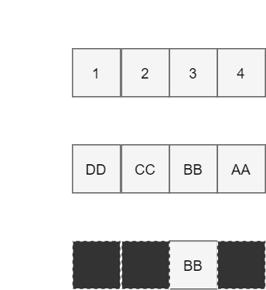

<!-- _class: lead invert --->

### C#のキモイ高速プログラミング
群馬高専 5年 電子メディア工学科
ぎもちん ([@SKKbySSK_TC](https://twitter.com/SKKbySSK_TC))


---

#### C#には面白い機能がたくさんある
- foreach
- Attribute
- Reflection
- ref struct
- unsafe
- fixed
- GC

---

## `unsafe`とは？
- C#でポインタ操作を可能にする
```
int x = 50;
int* ptr = &x; // xのポインタを取り出す
*ptr /= 2; // ポインタの指すデータを2で割る(50 / 2 = 25)

Console.WriteLine(x);
```
Output
```
25
```

---

## 今回やること
byte[]をfloat[]へ変換する


---

## 1. 単純な変換方法
`BitConverter`と`for`を使って変換する

```
const int size = 1024;
byte[] source = new byte[size]; //変換前データ
float[] converted = new float[size / sizeof(float)]; //変換後データ

for (int i = 0; i < converted.Length; i++)
{
    converted[i] = BitConverter.ToSingle(source, i * 4);
}
```

---

## 2. unsafeによる変換方法

```
const int size = 1024;
byte[] source = new byte[size]; //変換前データ
float[] converted = new float[size / sizeof(float)]; //変換後データ

// 配列のアドレスを一時的に固定する
fixed (float* convertedPtr = converted)
fixed (byte* sourcePtr = source)
{
    // byte* -> float*へキャストして4バイトずつ処理する
    float* floatSourcePtr = (float*)sourcePtr;
    for (int i = 0; i < converted.Length; i++)
    {
        convertedPtr[i] = floatSourcePtr[i];
    }
}
```

---

## 結果
- BenchmarkDotNetを使って測定
  - [ArrayConversionTest.cs](https://github.com/SKKbySSK/lt-resources/blob/5d6a318e3bfa2bf9a905c4c2617ac481e74e53f4/csharp-wicked-programming/Benchmark/ArrayConversionTest.cs)

 Method |          平均 |
------- |---------------|
 単純な変換 | 1,534.6059 ns |
 unsafeによる変換 |   783.1249 ns |


<!--- _footer: ※ 変換前データを初期化する時間は含んでいません --->

---

<!-- _class: lead invert --->
## 早いぞ！でも・・・
- メモリの固定や確保によるオーバーヘッド
- 変換後のデータ格納用配列が余計にメモリ喰う

---

<!-- _class: lead invert --->
#### byte配列をfloat配列として使えばええやん

---

<!-- _class: lead invert --->
## 構造体を使おう！

---

<!-- _class: lead invert --->
## 構造体
- C#では構造体のメモリ構造を指定できる
  - Cの`union`みたいなことができる
- `StructLayout`と`FieldOffset`属性を組み合わせる

---

#### 例

```
// メモリ構造を明示することをコンパイラに伝える
[StructLayout(LayoutKind.Explicit)]
struct SampleStruct
{
    [FieldOffset(0)] // 0バイト目にAを配置する
    public int A;

    [FieldOffset(2)] // 2バイト目にBを配置する
    public byte B;
}

SampleStruct data = new SampleStruct();
data.A = 0xDDCCBBAA;
Console.WriteLine(data.B); // 187(0xBB)
```

<!--- _footer: ※エンディアンによっては 204(0xCC) と出る場合もあります --->

---

<!-- _class: lead invert --->
メモリレイアウト


---

## 3. Unionもどき

```
[StructLayout(LayoutKind.Explicit)]
struct UnionArray
{
    [FieldOffset(0)]
    public float[] Float;

    [FieldOffset(0)]
    public byte[] Byte;
}

const int size = 1024;
byte[] source = new byte[size]; //変換前データ

UnionArray union = new UnionArray() { Byte = source };
float[] converted = union.Float;
```

---

<!-- _class: lead invert --->
## もう一度計測！！

---

## 結果
- 測定条件は前回と同じ

 Method |          平均 |
------- |---------------|
 単純な変換 | 1,534.6059 ns |
 unsafeによる変換 |   783.1249 ns |
  **Unionもどきによる変換** |     **0.9233 ns** |

---

<!-- _class: lead invert --->
## 圧倒的パフォーマンス！！

---

## Unionもどきの注意点
- 境界チェックが狂う
  - 配列の長さを記録しているメモリが書き変わらないため
  - 無理やり書き換える方法は以下参照
  [ArrayConversionTest.cs#L68-L84](https://github.com/SKKbySSK/lt-resources/blob/yuru-lt-0.1.0/csharp-wicked-programming/Benchmark/ArrayConversionTest.cs#L68-L84)

- 型情報も狂う
  - 同様に、型情報のメモリも書き変わらないため

---

<!-- _class: lead invert --->
# 用量・用法はほどほどに
- 可読性がとても悪い
- メモリを意識する必要がある
- オーディオプロセッシング等ではかなり便利
- **単純な変換方法でも十分早い**

---

<!-- _class: lead invert --->
## ご清聴ありがとうございました！
### 楽しいC#ライフを！


<!--- 
## 制約
- Managed型のポインタは取れない
  - GCによりアドレスが実行中に変化するため

  | Managed | Unmanaged |
  | --- | --- |
  | class | int, float等 |
  |       | struct |
  |       | enum   |

--->
